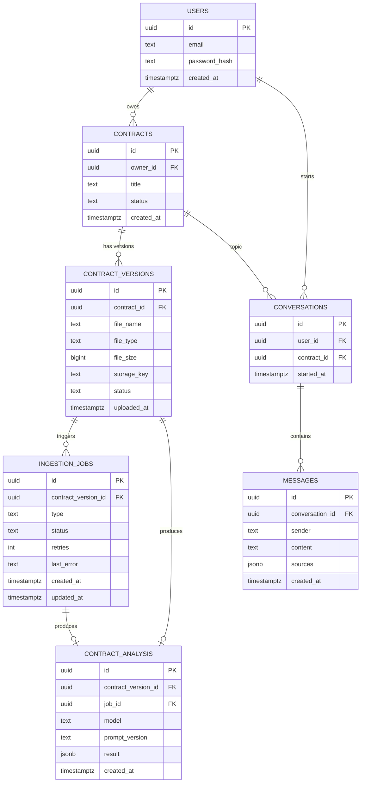

# Database Schema

Status: Approved | Depends on: P0-02 | Implements in: `packages/database/schema.sql`

## 1. Entity-Relationship Diagram



## 2. Design Notes

- **UUID primary keys** everywhere (`gen_random_uuid()`, `pgcrypto`) — safe to generate
  client-side/worker-side for idempotency (see §3).
- **`ContractAnalysis` is append-only.** Re-running analysis inserts a new row; nothing is
  updated in place. `contract_versions.id` is therefore not a unique constraint on
  `contract_analysis` — the latest row per version is selected by `ORDER BY created_at DESC
  LIMIT 1`.
- **Indexes**: every FK column, plus `contracts(owner_id, status)`,
  `ingestion_jobs(contract_version_id, status)`, and `messages(conversation_id, created_at)` for
  the access patterns the API actually uses (list-by-owner, poll-by-job, paginate-by-conversation).
- **`ingestion_jobs.last_error`** and all text/jsonb columns storing model output are subject to
  the sensitive-logging rules in `docs/architecture/error-model.md` — never raw document text.

## 3. Idempotency Keys

Per the async-processing principle in architecture.md, workers must be safe to re-run. Two
extra infrastructure tables support this and prompt reproducibility:

- `prompt_versions` — see §4.
- A **unique constraint** on `(contract_version_id, type)` for *in-flight* jobs (partial index
  `WHERE status IN ('QUEUED','PROCESSING')`) prevents duplicate concurrent jobs of the same type
  for the same version.

## 4. Additional Infrastructure Entities

```text
PromptVersion(id, name, version, template, model, embeddingModel, createdAt)
AuditEvent(id, userId, action, resourceType, resourceId, metadata jsonb, createdAt)
```

`PromptVersion` backs the Prompt Registry (Phase 11). `AuditEvent` backs security/audit logging
(Phase 12) and is intentionally generic so it doesn't need a migration per new event type.

## 5. Acceptance

Satisfies P0-03: schema supports all core entities (§ domain-model.md) and their lifecycle
states (`contracts.status`, `contract_versions.status`, `ingestion_jobs.status`). Executable DDL
is in `packages/database/schema.sql`.
